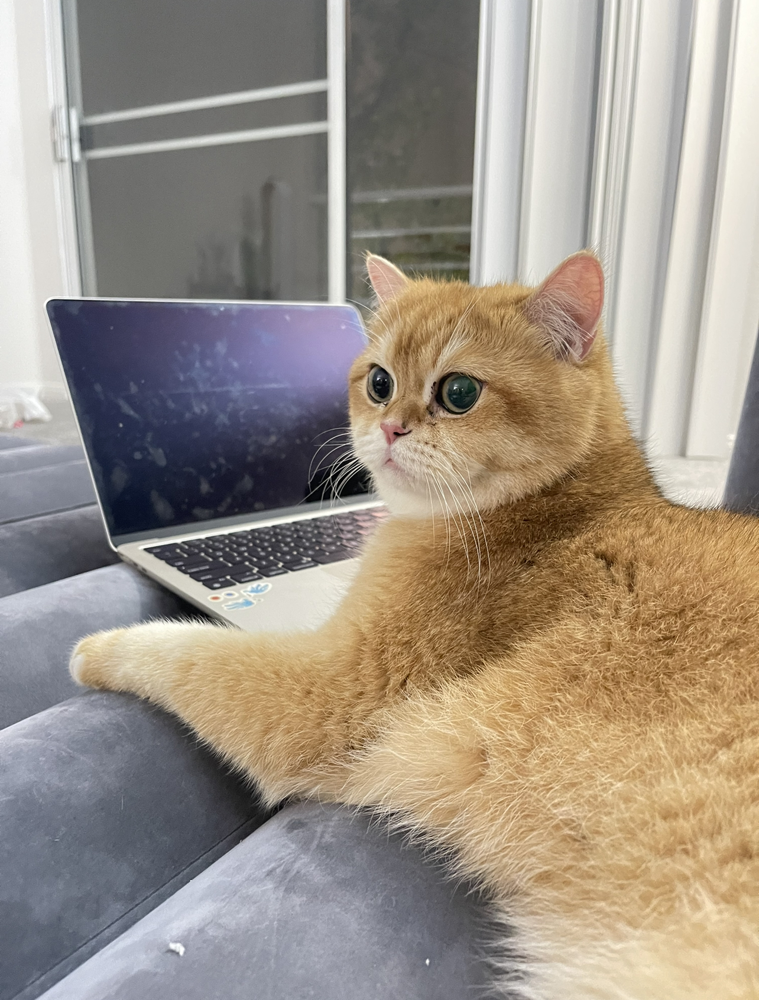

# Chang Shu's User Page

## I am a second year ERC student and majoring in Math-CS.

- I am familiar with 
  1. Java
  2. Python
  3. C++.
- My favorite programming language is **C++**.
- I hope to be a **computer programmer** in the future.
- Here is my github account.
  - [github link](https://github.com/Cathyyyyy123)


## In my spare time,
- I usually ```work out``` to relax myself.
- I like hanging out with my friends.
- My favorite food is **Hot Pot**. 
  - Here is the food if like [link to the photo](#hotpot)
- I have two lovely kitties. {#cats}
  - Here are two kitties [link to cats](#cats)

## Here are some goals in my life:
- [ ] Diving
- [ ] Sky Diving
- [x] Travel with friends
- [x] Study at UCSD
- [ ] Get an internship
- [ ] Have a boyfriend
- [ ] Get married
- [ ] Have a decent job

### Here are my two favorite quotes:

> Don't settle for average. Bring your best to the moment. Then, whether it fails or succeeds, at least you know you gave all you had.

> Inspiration does exist, but it must find you working.


I am really looking forward to collaborte with others in CSE110 and learn more about coding.


{#hotpot}


His name is Pancake and he is one year old.
[link to Pancake](CSE110-lab1/IMG_2927.jpg){#cats}

His name is Princess and he is also one year old.
[link to Princess](CSE110-lab1/IMG_2928.jpg)


